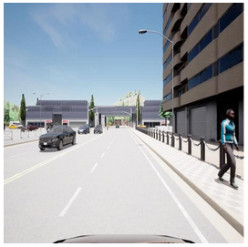

# _T2I-Adriver_: Enhancing Test Generation for Autonomous Driving using Multiple Conditionings Probabilistic Diffusion Models


_Deep Learning (DL) has become a core technology across industries such as healthcare, finance, and, particularly, autonomous driving.
Specifically, in the context of autonomous driving, DL models are critical for tasks like object detection, semantic segmentation, and decision making but must be rigorously tested to ensure safety, as even minor errors can lead to catastrophic outcomes. However, testing systems based on DL introduces new challenges.
Traditional testing methods are inadequate for DL models, which operate as complex black boxes with behaviors that are difficult to explain and understand. Additionally, testing in autonomous driving poses additional challenges due to the high cost, risks, and difficulties in reproducing real-world scenarios, such as hazardous weather conditions or dangerous interactions with pedestrians.
To address these challenges, this thesis introduces a novel approach using conditional diffusion models to systematically generate new test cases for autonomous driving. Our approach exploits metamorphic testing  and metamorphic relationships to tackle the complex nature of DL-based systems. The solution proposed in this thesis builds on an existing conditional diffusion model, T2I-Adapter, and extends it to allow multiple inputs to guide the image generation process. We fine-tuned the proposed solution using SHIFT, a comprehensive dataset of simulated driving scenarios, including diverse weather patterns and road conditions._

The methodology proposed in this project introduces a novel approach to generating realistic test scenarios for autonomous driving systems using a fine-tuned diffusion model. The model leverages multiple conditioning inputs to control and enhance image generation, ensuring flexibility and precision. Additionally, the proposed approach exploits metamorphic testing in order to tackle the Oracle Problem and generates new test cases with known corresponding ground truth.
Our solution is based on the [T2I Adapter](https://github.com/TencentARC/T2I-Adapter/tree/SD) architecture, chosen for its flexibility and efficiency in handling multiple conditioning inputs such as color, semantic labels, and sketches. This model is more advantageous than ControlNet as it supports a broader range of conditionings and operates with a smaller computational load, making it more efficient. The integration of multiple conditioning inputs enables the generation of highly specific and realistic test scenarios, crucial for evaluating autonomous driving systems in diverse environments such as varying weather conditions and road structures. Conditioning inputs supported by our solution include color, semantic segmentation, sketch, and depth, each contributing uniquely to the generated images. Color conditioning helps depict environmental details like weather and time of day, while semantic conditioning offers pixel-level object distinction, enhancing scene comprehension. Sketch conditioning captures object outlines, crucial for road images, and depth conditioning provides spatial depth, essential for accurately placing objects within the scene. 


The figure above reports the images generated by our approach with all its configurations. The figure at the top reports an overview of the proposed solution. It is fine-tuned using the [SHIFT](https://github.com/SysCV/shift-dev) dataset, which provides a large variety of traffic scenarios and weather conditions, enhancing the model ability to generate realistic and diverse test cases. The methodology relies on transfer earning, where pre-trained components like the Stable Diffusion model and CLIP text embedder remain static to preserve their generative capabilities, while only the fuser and Adapter components are actively trained. This design choice ensures efficiency, reducing the need for extensive computational resources. Ultimately, the proposed solution’s ability to combine multiple conditionings allows testers to create tailored scenarios for autonomous driving systems, providing a powerful tool for ensuring safety and performance in real-world environments. The flexibility in mixing conditionings, as explored in the section on different configurations, offers users the ability to prioritize specific aspects of the generated images, making the solution adaptable to various testing needs.

Original             | Example 1             |  Example 2
:-------------------------:|:-------------------------:|:-------------------------:
 |    |  

## Repository

The repository contains all the code responsible for training and running the models. It is important to configure the corresponding `.yaml` files in `T2I-Adriver/configs` to be able to choose the embedding and conditioning models.

The training files are titled `train*.py`, while the inference files are called `app*.py`. The possibility of running a gradio server is available at `app_gradio_server.py`.

An example of running a **training** run is shown next:
```
$ python T2I-Adriver/train2.py -t \
    --base configs/pl_train/coadapter-v1-train_color_depth_sketch.yaml \
    --train True --test False --gpus 1 --gpu 0 --scale_lr True \
    --num_nodes 1 --sd_finetune_from models/sd-v1-4.ckpt \
    --coadapter_finetune_from models/coadapter-fuser-sd15v1.pth \
    --name coadapter-color-depth-sketch
```

>-> Get parser
-> Start over
Global seed set to 42
-> Init and save configs
-> Merge trainer cli with config
Running on GPUs 1
-> Instantiate model
/opt/conda/lib/python3.10/site-packages/torchvision/transforms/functional_tensor.py:5: UserWarning: The torchvision.transforms.functional_tensor module is deprecated in 0.15 and will be **removed in 0.17**. Please don't rely on it. You probably just need to use APIs in torchvision.transforms.functional or in torchvision.transforms.v2.functional.
  warnings.warn(
CoAdapter: Running in eps-prediction mode
Setting up MemoryEfficientCrossAttention. Query dim is 320, context_dim is None and using 8 heads.
Setting up MemoryEfficientCrossAttention. Query dim is 320, context_dim is 768 and using 8 heads.
Setting up MemoryEfficientCrossAttention. Query dim is 320, context_dim is None and using 8 heads.
Setting up MemoryEfficientCrossAttention. Query dim is 320, context_dim is 768 and using 8 heads.
Setting up MemoryEfficientCrossAttention. Query dim is 640, context_dim is None and using 8 heads.
Setting up MemoryEfficientCrossAttention. Query dim is 640, context_dim is 768 and using 8 heads.
Setting up MemoryEfficientCrossAttention. Query dim is 640, context_dim is None and using 8 heads.
Setting up MemoryEfficientCrossAttention. Query dim is 640, context_dim is 768 and using 8 heads.
Setting up MemoryEfficientCrossAttention. Query dim is 1280, context_dim is None and using 8 heads.<br>
...<br>
>Epoch 28:  95%|▉| 19/20 [16:40<00:52, 52.66s/it, loss=0.0905, v_num=0, train/losData preparation on gpu
Coadapter fuser step <br>
Epoch 28: 100%|█| 20/20 [16:40<00:00, 50.04s/it, loss=0.0857, v_num=0, train/losAverage checkpoint generating time: 1000.90 seconds
Average Peak memory 13696.17MiB

---

An example of doing **inference** with the trained model is shown next:

```
$ python T2I-Adapter/app_script.py
```
>Loading model from T2I-Adapter/models/sd-v1-4.ckpt
CoAdapter: Running in eps-prediction mode
Setting up MemoryEfficientCrossAttention. Query dim is 320, context_dim is None and using 8 heads.
Setting up MemoryEfficientCrossAttention. Query dim is 320, context_dim is 768 and using 8 heads.<br>
...<br>
Setting up MemoryEfficientCrossAttention. Query dim is 320, context_dim is None and using 8 heads.
Setting up MemoryEfficientCrossAttention. Query dim is 320, context_dim is 768 and using 8 heads.<br>
DiffusionWrapper has 859.52 M params.<br>
making attention of type 'vanilla-xformers' with 512 in_channels<br>
building MemoryEfficientAttnBlock with 512 in_channels...<br>
Working with z of shape (1, 4, 32, 32) = 4096 dimensions.<br>
making attention of type 'vanilla-xformers' with 512 in_channels<br>
building MemoryEfficientAttnBlock with 512 in_channels...<br>
color<br>
depth<br>
seg<br>
-> Using sd_model:  CoAdapter<br>
-> Using sampler:  DDIMSampler<br>
Global seed set to 42<br>
PROMPT: A car is driving down a highway at daylight. The road is empty, and there are no other cars or pedestrians visible. Some mountains can be seen at the background and some trees to the left of the road.<br>
Data shape for DDIM sampling is (1, 4, 64, 64), eta 0.0<br>
-> DDIM PARAMS: torch.Size([1, 77, 768]) (1, 4, 64, 64) None None False None None False 0.0 1.0 None None None 100 1.0 None 4 None 1.0 1.0<br>
Running DDIM Sampling with 50 timesteps<br>
DDIM Sampler: 100%|█████████████████████████████| 50/50 [00:02<00:00, 16.75it/s]<br>


---

Other examples of training / inference are present in the `train_1.ipynb` and `big_train_1.ipynb` notebooks.

Additionally, other SOTA models used for metamorphic testing can be tried out in `sota_generate_images.ipynb`.

## Q&A

For more information about the project, please take a look at the following [document](doc/2024_10_Enriquez_Thesis.pdf).

The project was carried out as a Master Thesis in _Politecnico di Milano_ for the Mathematical Engineering MSc program.

For any doubts, please contact me at j.enriquezballe@gmail.com